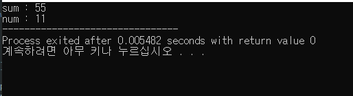
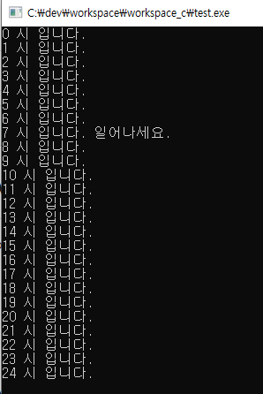
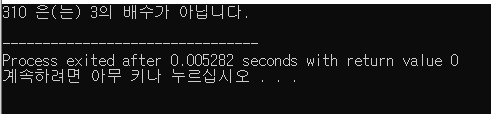
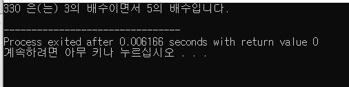
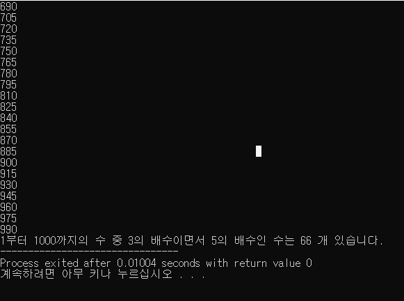
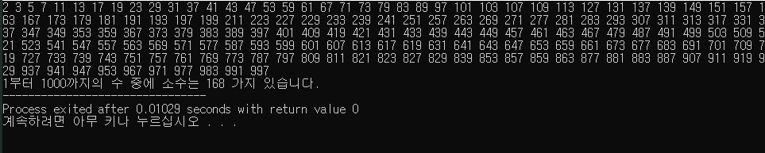
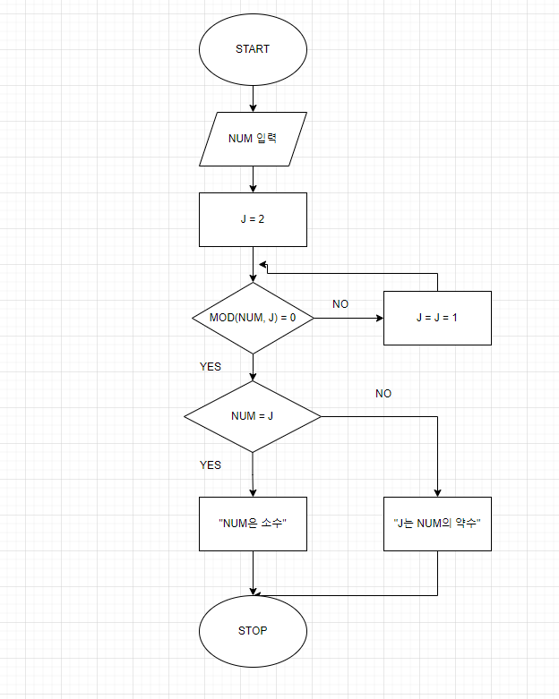
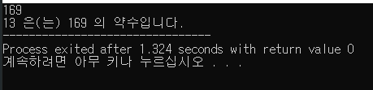

# Day2
24.2.16

## coumputer science

- 논리회로설계
  
- C언어 기초
  
  1) 1부터 10까지의 수를 더하는 코드(add_c.c)

  2) 0시부터 24시까지 시간이 흐르나, 7시에 알람이 울리는 코드(time.c)

 

  3) 3의 배수인지 아닌지 구분하는 코드(3.c)

 

  3+) anb를 이용하여 3과 5의 배수를 구분하는 코드(3_2.c)

 

  3++) 1부터 1000까지의 수 중 3과 5의 공배수를 출력하고, 몇가지인지 세는 코드(3_3.c)

 

  4) 1부터 1000까지의 수 중 소수는 무엇이고, 총 개수는 몇 개인지 세는 코드(primeNum.c)

 

  5) 해당 설계도(a)를 보고 코드 작성(b)(primeEx.c)

    (a)

 

    (b)

 
