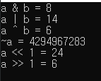
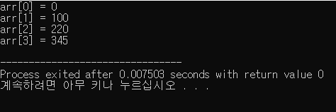
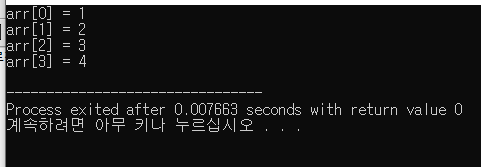
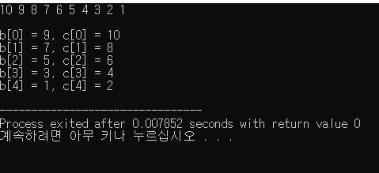
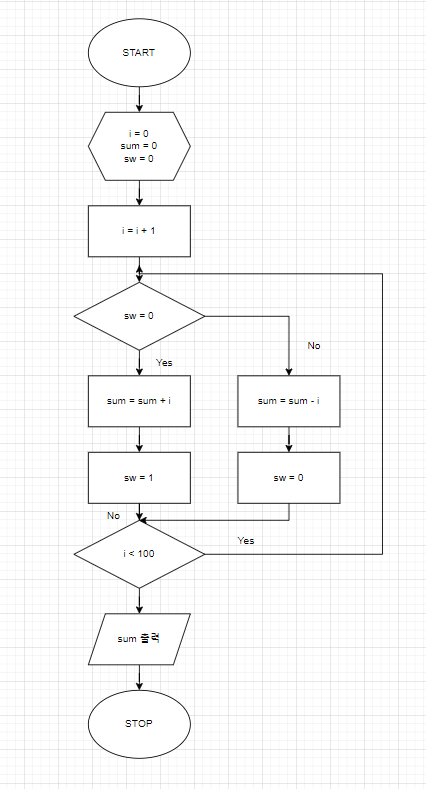
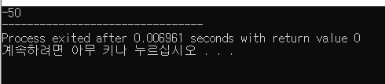

# DAY3
24.02.19

## Computer Science

- 논리회로설계 응용

  a. 가산기

  b. C 프로그래밍을 통한 2진법 계산

    기초 (2.c)

    

- IEEE 754 부동소수점 계산

- C 프로그래밍

  a. 배열

  기초

    > 배열에 저장된 수를 순서대로 출력 (arr.c)

  

    > 반복문을 사용하여 배열의 값을 새로 입력 후 출력 (arr2.c)

  

    > a배열에 저장된 수를 홀수와 짝수로 나누어 b배열과 c배열에 따로 저장 (arr3.c)

  

  b. 아래 순서도를 보고 코드 작성 (loop.c)

    > 1 - 2 + 3 - 4 ...

  

  
