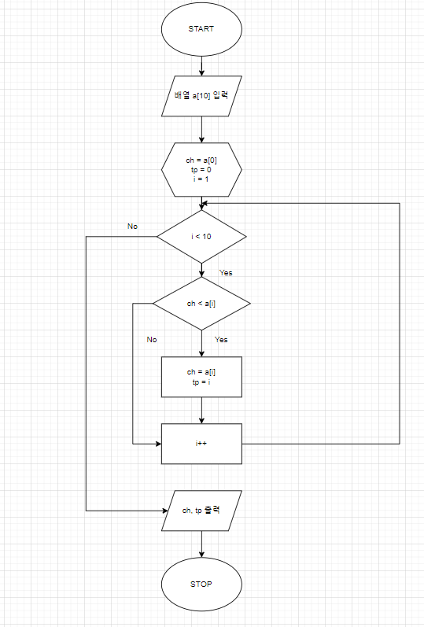
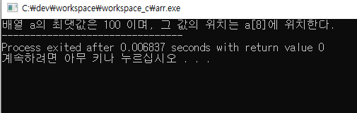
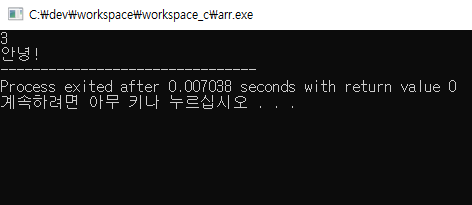
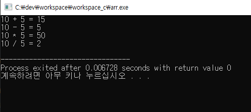
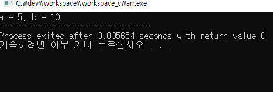

# Day 4
24.2.20

## Computer Science

- OSI 7 Layer                                 
  * 응용계층                                     
  * 프리젠테이션 계층                             
  * 세션계층                 
  * 전송계층                                  
  * 네트워크계층
  * 데이터링크계층
  * 물리계층
 
- TCP / IP 4 Layer

  * 응용계층
  * 전송계층
  * 네트워크계층
  * 네트워크액세스계층

- 프로세스 / 스레드

  * 프로세스

     CPU의 작업 획득

  * 스레드
 
     프로세스 안에 포함되어 있음. 병행처리를 하기 위한 기법.

- CPU 선점 / 비선점

   * 비선점

     > FIFO
     > SJF
     > HRN

  * 선점

    > SRT
    > RR
    
- C 프로그래밍

  * 알고리즘

    주어진 문제를 보고 순서도를 작성한 후 코드 작성. (ex.c)

    배열에 저장된 숫자 중 최댓값을 찾고, 그 최댓값의 위치를 출력하는 코드를 작성하라.

       순서도

    

       실행 화면

    

  * 함수
    int 와 void를 사용해 함수 만들어 사용 (function.c)

    

    사칙연산을 함수로 지정하여 main에 호출 (sum.c)

    

    swap 함수 (swap.c)

    
