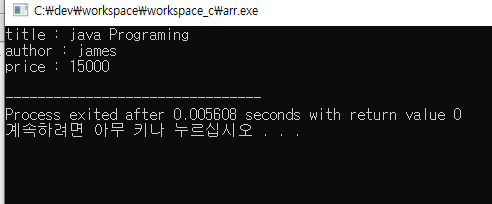
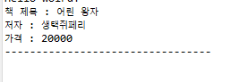
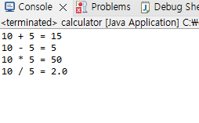
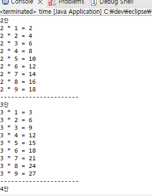

# Day 5
24.2.21

## Computer Science

  - 구조체의 이해 (str.c)

  

## Java Programing

  - 자바 기초

      접근성. getter setter 를 이용하여 private에 접근하기 (test.java / book.java)

    

      두 개의 클래스로 사칙연산 계산기 구현 (calculator.java / option.java)

    

      중첩 for 문으로 구구단 구현 (gugu.java)

    
