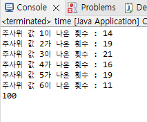

# Day 5
24.2.21

## Computer Science

  - 구조체의 이해 (str.c)

  

## Java Programing

  - 자바 기초

      접근성. getter setter 를 이용하여 private에 접근하기 (Test.java / Book.java)

    

      두 개의 클래스로 사칙연산 계산기 구현 (Calculator.java / Option.java)

    

      중첩 for 문으로 구구단 구현 (Gugu.java)

    

      랜덤한 수를 이용하여 주사위 굴리기 (Dice.java)

    
