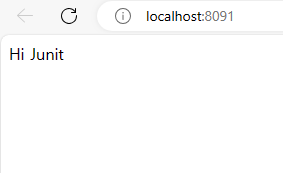

# DAY 4
24.4.30

## JunitExam

테스트 실행

--------------------------

aseertEquals(A, B)

assertThat(A).isEqualTo(B) --> AssertJ라이브러리

A값과 같은지 검증 isEqualTo(A)

A값과 다른지 검증 - isNotEqualTo(A)

A값을 포함하는지 검증 - contains(A)

A값을 포함하지 않는지 검증 - doesNotContain(A)

접두어가 A인지 검증 - startsWith(A)

접미어가 A인지 검증 - endsWith(A)

비어 있는 값인지 검증 - isEmpty()

비어 있지 않은 값인지 검증 - isNotEmpty()

양수인지 검증 - isPositive()

음수인지 검증 - isNegative()

1보다 큰 값인지 검증 - isGreaterThan(1)

1보다 작은 값인지 검증 - isLessThan(1)
