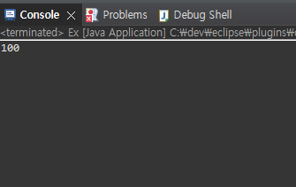
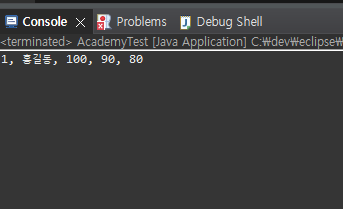
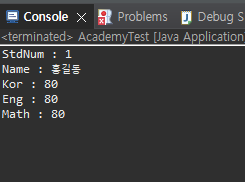
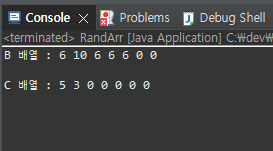

# DAY 2
24.2.23

## Java Programing

Class 연습 (Ex.java / F1.java / F2.java)

Class 연습 2 (AcademyTest.java / Student.java)

  ++ 간략화 (AcademyTest2.java / Student2.java)

a 배열에 저장된 랜덤한 수를 홀짝을 나누어 B와 C배열에 저장 (RandArr.java)

