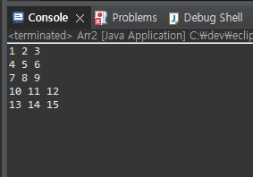
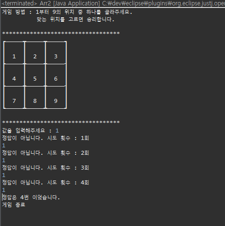

# Day3
24.2.26

## Java Programing

static 개념 잡기(Car.java / CarMain.java)

객체 간의 소통 (Bus.java / Student.java / GetBus.java)

+) 업그레이드 (Bus2.java / Student2.java / GetBus2.java)

2차원 배열 (Arr2.java)

  + 2차원 배열을 응용한 게임 제작 (Game.java)

          성공했을 경우
    
    

          실패했을 경우

    
