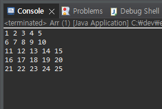
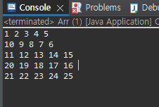
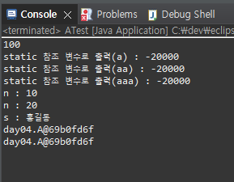
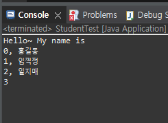
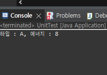

# Day 4
24.2.27

## Java Programing

2차원 배열 연습 (Arr.java)

  + 응용 (Arr2.java)

  

class 정의와 연습 (A.java / ATest.java)

static 정의와 연습 (Student.java / StudentTest.java)

class 간 상호작용 연습 (UnitTest.java / UnitA.java / UnitB.java)

