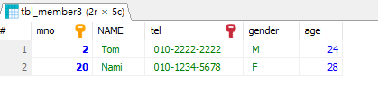
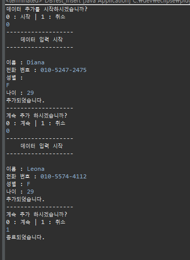
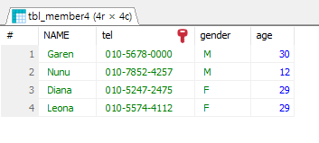
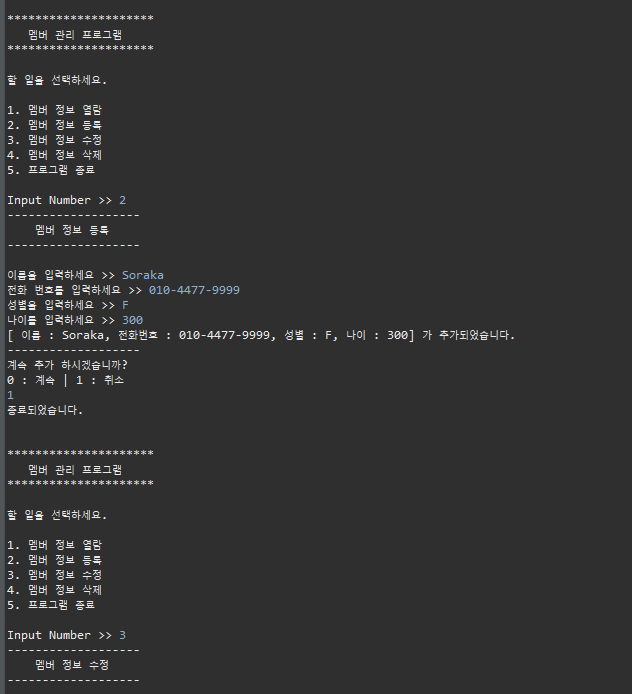
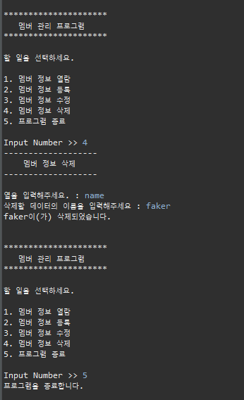
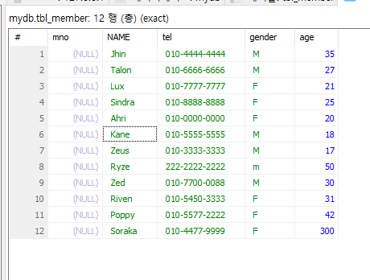

# Day 1
24.3.7

## DB

sql 기초 문법 (ex1.sql)

java 에서 데이터 추가 하여 DB에 담기 (input.java)

    java 실행 화면

    DBMS 확인

멤버 관리 프로그램

(UI.java / Insert.java / Delete.java / Update.java / Select.java / ex1.sql)

        java 실행 화면

        sql 화면

