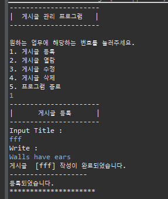
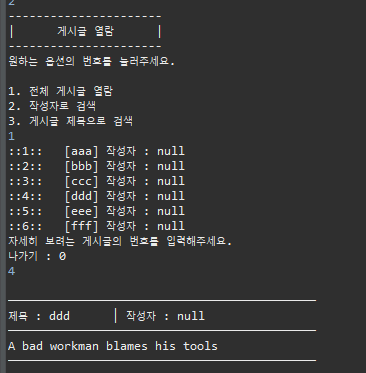
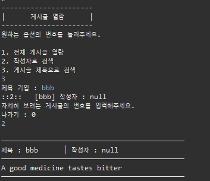
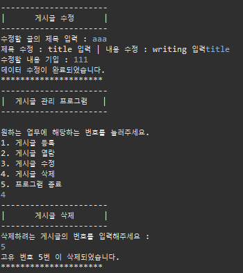

# Day 2
24.3.8

## DB

게시글 작성 관리 프로그램

(note :: Connect.java / IMemberDao.java / MemberDao_maria.java / UI.java / MemberManager.java / Member.java)

sql :: 

CREATE TABLE tbl_note (

   mno INT AUTO_INCREMENT PRIMARY KEY,
   
   id VARCHAR(20),
   
   title VARCHAR(20) NOT null,
   
   writing CHAR(100) NOT NULL
   
);

      insert

  

      select (전체)

  

      select (지정)

  

      delete & update

  

      결과 확인

  
