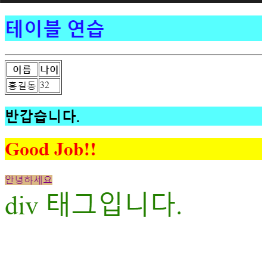
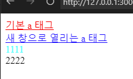
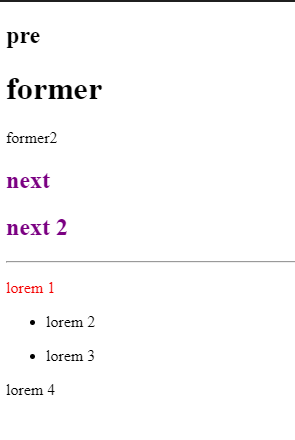
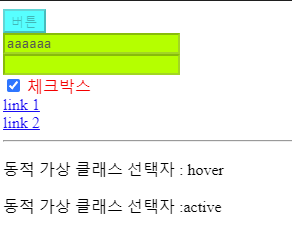
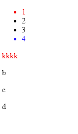
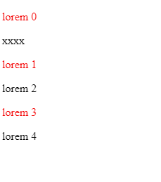

# Day 1
24.3.21

## HTML / CSS

css style 연습

    테이블 연습 (cssEx01.html)

    a 타입, title 연습 (cssEx02.html)

    style 지정 연습 (cssEx03.html)

    visited / hover/ active / input / disable 연습 (cssEx04.html)

    li style 지정 연습 (cssEx05.html)

    nth-child 연습 (cssEx06.html)

