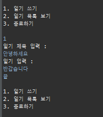
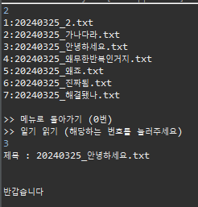
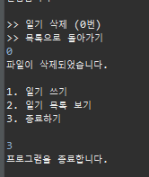
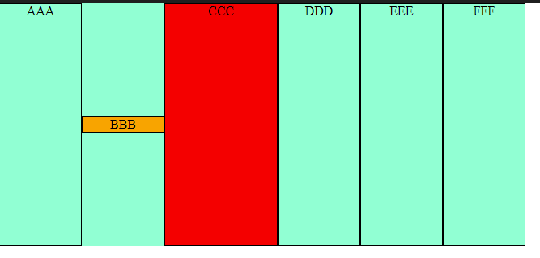
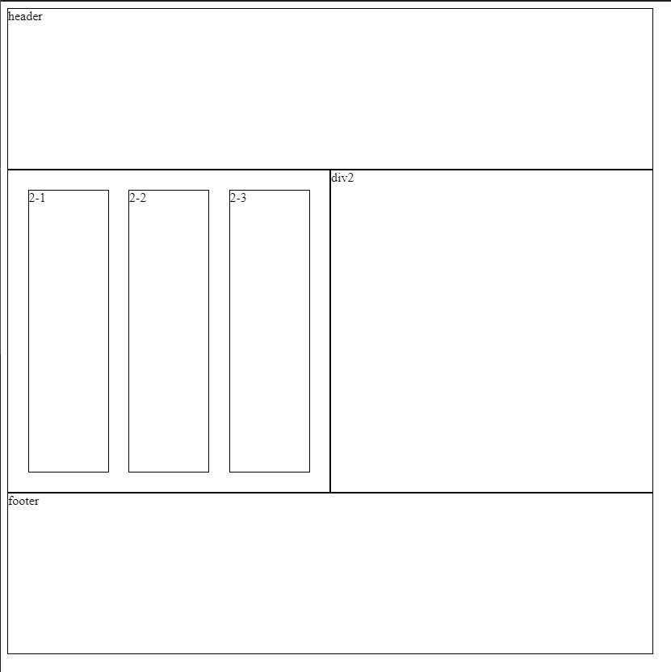

# DAY 3
24.3.25

## Java Programing

Q.txt 파일을 보고 프로그램 만들기 >> 일기장 프로그램 제작 (Diary)

    DiaryTest.java - 일기장 실행 메인 매소드

    DiaryWriter.java - 일기 작성 / 저장

    DiaryContents.java - 목록 열람

    PrintDiary.java - 일기 출력 / 삭제

## HTML / CSS

    flex 연습(flex00.html)

    flex 연습 2 (flex01.html)

