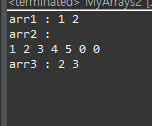
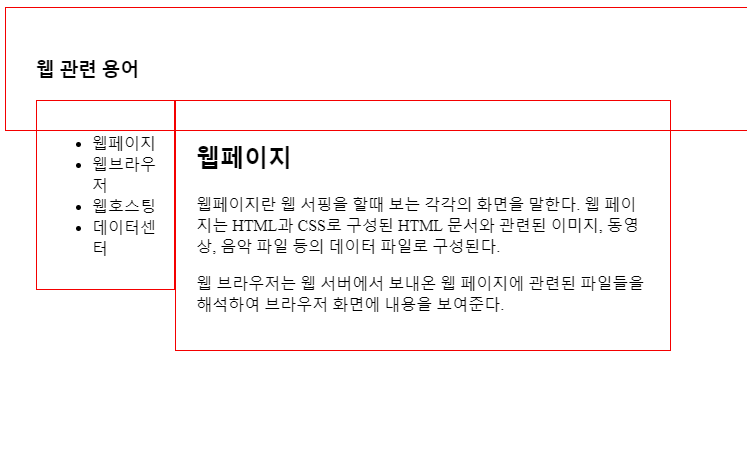
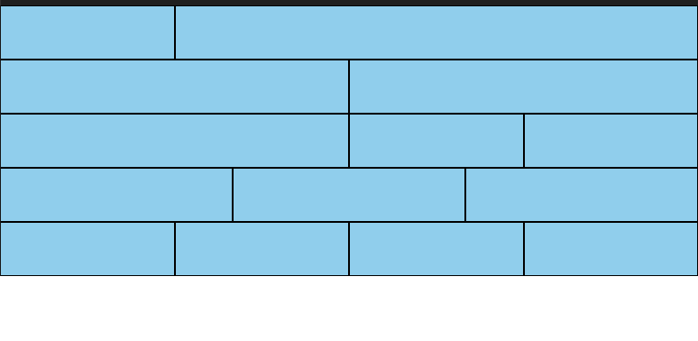
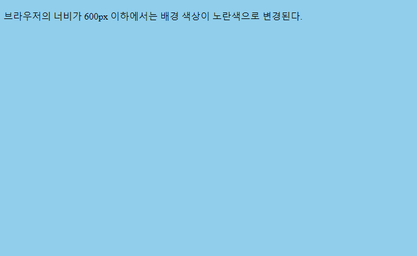
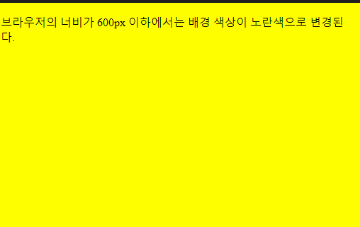
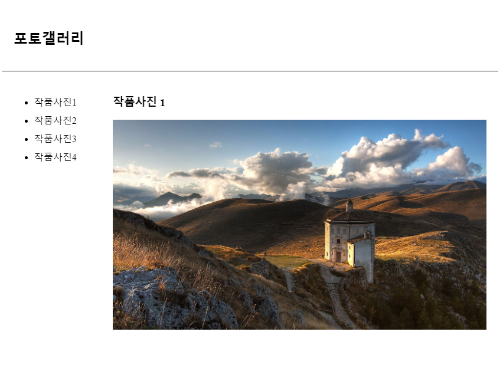
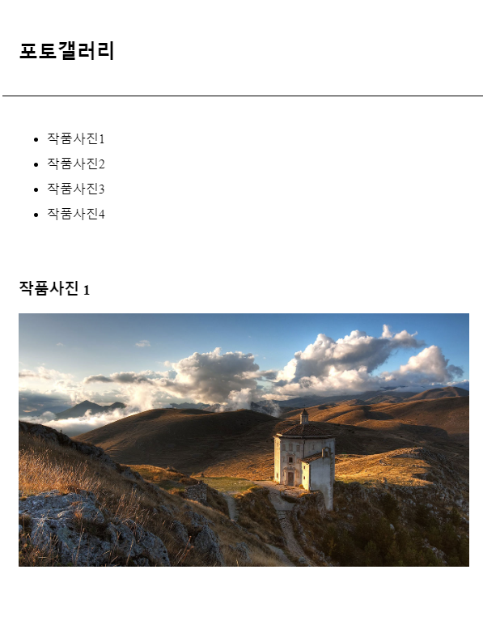
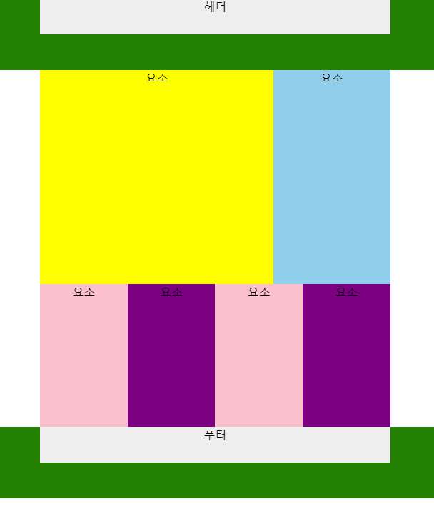
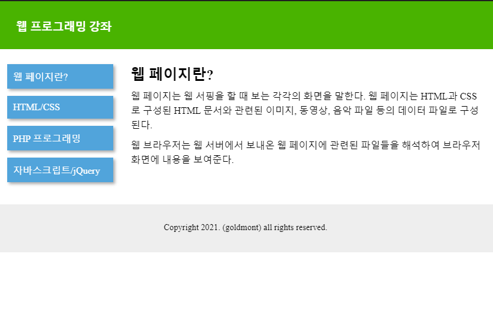
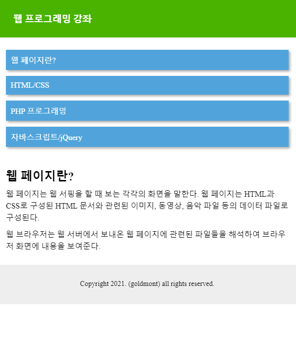

# DAY 1
24.3.28

## Java Programing

copyOf 연습 (MyArrays2.java)

## HTML / CCS

ex01.html

ex02.html

 

font-size : em 연습 - ex03.html

font-size : em연습 2 - ex04.html

ex05-grid12.html

media 연습 - ex06_media.html

image 연습 - ex07_image.html

image 연습 2 - ex08_image2.html

ex10-9.html

ex11_2.html

